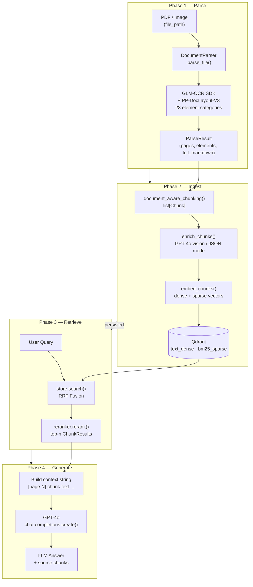

# System Overview

The pipeline has four sequential phases. Phase 1 (Parse) converts raw documents into structured elements using GLM-OCR and PP-DocLayout-V3. Phase 2 (Ingest) chunks, enriches, embeds, and stores those elements in Qdrant. Phase 3 (Retrieve) runs hybrid dense+sparse search with optional reranking. Phase 4 (Generate) builds a context string from retrieved chunks and calls GPT-4o.

