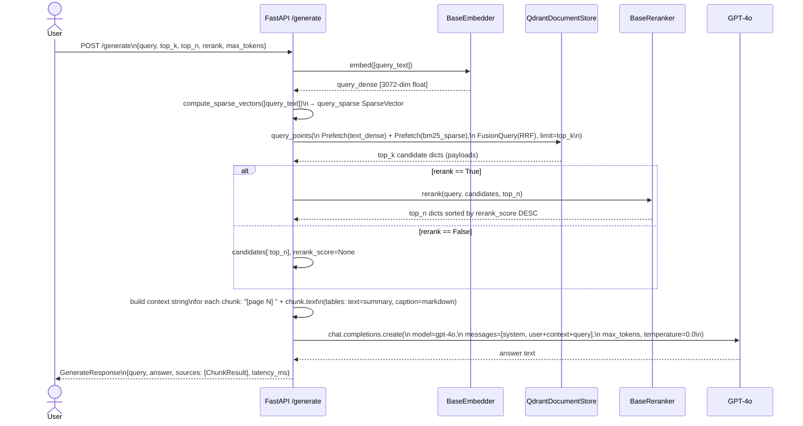

# Full RAG Pipeline (End-to-End Sequence)

A complete trace of a `POST /generate` request from the user's question to the final answer. The API embeds the query twice (dense + sparse), runs hybrid retrieval via Qdrant's RRF fusion, reranks the candidates, assembles a context string from the top-n chunks, and calls GPT-4o — returning the answer together with its source chunks and latency.

