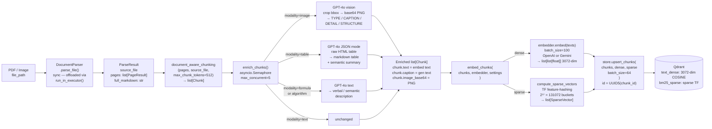

# Ingestion Pipeline

Triggered by `POST /ingest` or `scripts/ingest.py`. A single document travels through five stages: synchronous parsing (offloaded to a thread executor in async contexts), structure-aware chunking, per-modality GPT-4o enrichment (controlled by `asyncio.Semaphore`), dual dense+sparse embedding, and batched upsert to Qdrant.

