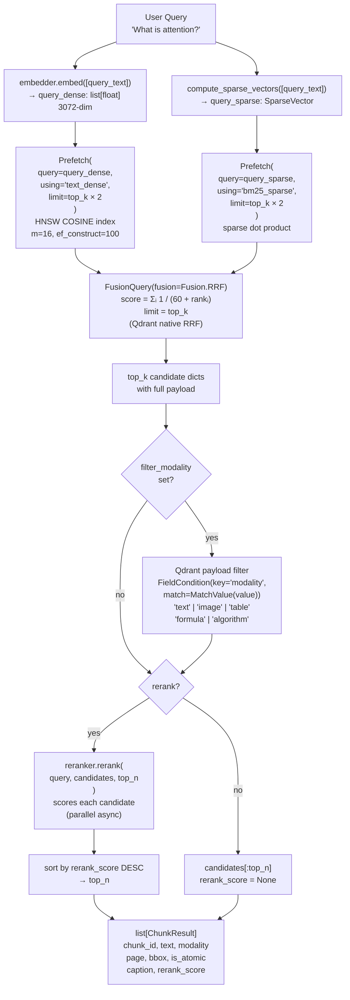

# Retrieval Pipeline

Triggered by `POST /search` or the first half of `POST /generate`. The query is embedded into both a dense vector (cosine similarity) and a sparse BM25 vector, sent to Qdrant as two simultaneous `Prefetch` arms, fused via Reciprocal Rank Fusion, and optionally reranked. An optional modality filter narrows results to a single chunk type.

