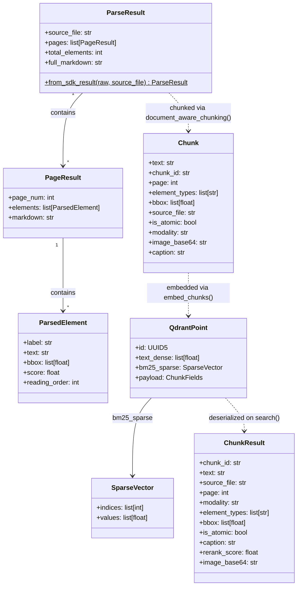

# Data Structures

The core data types that flow through the pipeline. `ParsedElement` is the atomic OCR output per element. `PageResult` aggregates elements per page. `ParseResult` wraps the entire document. `Chunk` is the RAG unit after chunking and enrichment. `QdrantPoint` is what gets stored. `ChunkResult` is the API response model returned to callers.

