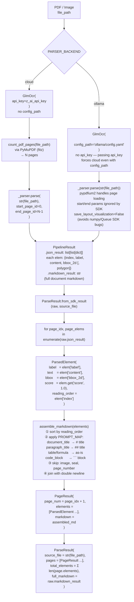

# Parsing Pipeline

`DocumentParser.parse_file()` wraps the GLM-OCR SDK and branches on `PARSER_BACKEND`. The cloud path must explicitly pass `start_page_id=0, end_page_id=N-1` — without them the SDK silently parses only page 1. The Ollama path ignores that range parameter and handles pages internally via pypdfium2. Both paths produce an identical `ParseResult` downstream.

