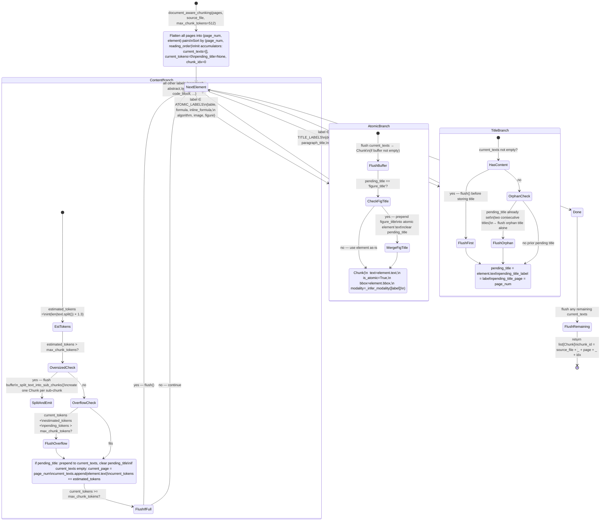

# Chunking Architecture

`document_aware_chunking()` is a single-pass state machine over all pages. It maintains three parallel states: **Atomic** (tables, formulas, images — always own chunk, never split), **Title** (pending attachment to the next content element, even across a page boundary), and **Content** (accumulate into a buffer until `max_chunk_tokens` is reached). Token count is estimated as `word_count × 1.3`.

