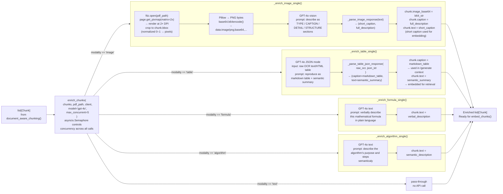

# Multimodal Chunk Enrichment

`enrich_chunks()` runs after chunking and mutates chunks in-place. Each modality has a dedicated async handler. Image chunks are cropped from the PDF using PyMuPDF, encoded as base64 PNG, and described by GPT-4o vision. Table chunks are sent to GPT-4o in JSON mode, producing both a full markdown table (stored in `caption` for LLM generation) and a semantic summary (stored in `text` for embedding). Formula and algorithm chunks get verbal descriptions. Text chunks are unchanged.

