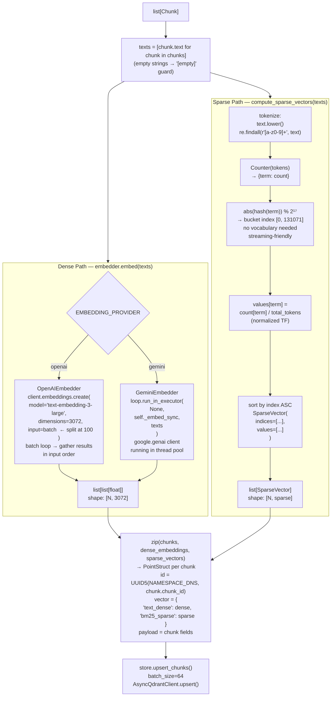

# Embedding Architecture

`embed_chunks()` produces two parallel representations per chunk. The dense path calls either `OpenAIEmbedder` (batched `embeddings.create`, max 100 texts per call) or `GeminiEmbedder` (sync SDK offloaded via `run_in_executor`). The sparse path runs entirely locally: tokenize → term-frequency count → feature-hash into 2¹⁷ = 131,072 buckets → normalize — no vocabulary, no external API. Both are returned as a tuple and zipped with chunks to build `PointStruct` objects for Qdrant.

