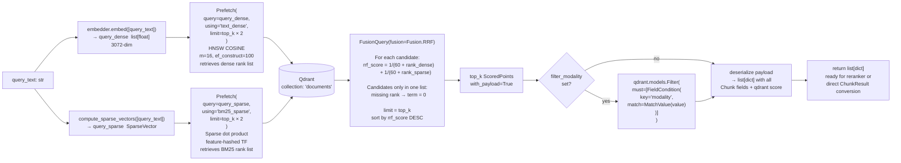

# Hybrid Search and RRF Fusion

`store.search()` embeds the query into both vector spaces, sends them as two independent `Prefetch` arms to Qdrant, and combines their ranked lists using Reciprocal Rank Fusion (RRF). RRF score = Σᵢ 1/(k + rankᵢ) where k = 60. Because RRF operates on rank positions rather than raw scores, it is robust to score-scale mismatches between dense cosine similarity and sparse dot-product — a key reason it outperforms simple score averaging.

