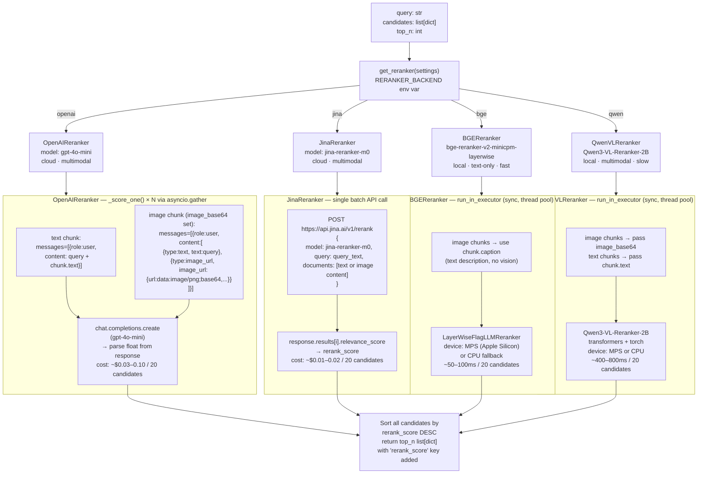

# Reranking Backends

`get_reranker(settings)` is a factory keyed on `RERANKER_BACKEND`. All four backends implement `BaseReranker.rerank(query, candidates, top_n) → list[dict]`, adding a `rerank_score` key to each candidate dict and returning them sorted descending. The two cloud backends (OpenAI, Jina) and the two local backends (BGE, Qwen VL) differ in latency, cost, and whether they can score image chunks visually.

