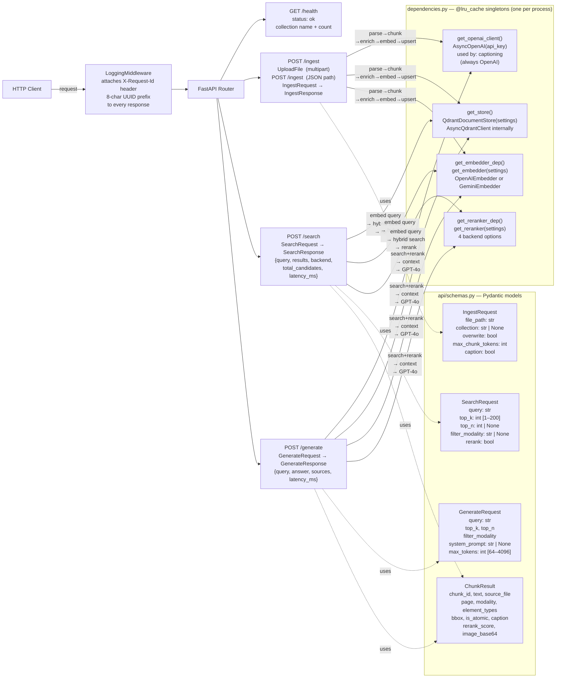

# API Architecture

`create_app()` builds the FastAPI application with a lifespan context manager (loguru setup), `LoggingMiddleware` (adds `X-Request-Id` header per request), and four route groups. All heavy dependencies — OpenAI client, Qdrant store, embedder, reranker — are created once per process via `@lru_cache` singleton factories in `dependencies.py`. The `get_openai_client()` dep is kept separate from `get_embedder_dep()` because captioning always needs OpenAI regardless of the configured embedding provider.

