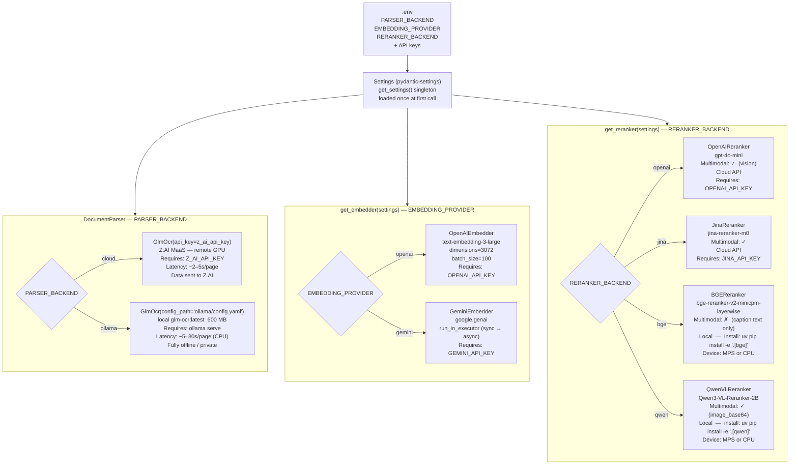

# Pluggable Backends (Strategy Pattern)

All runtime behaviour is controlled by three env vars read at startup by `get_settings()` (pydantic-settings singleton). Each axis is a classic strategy pattern: a factory function reads the config and returns the appropriate concrete implementation, all of which satisfy the same abstract interface. This means adding a new embedding provider or reranker requires only: a new subclass, a new key in the factory dict, and a new env-var value — no changes to callers.

