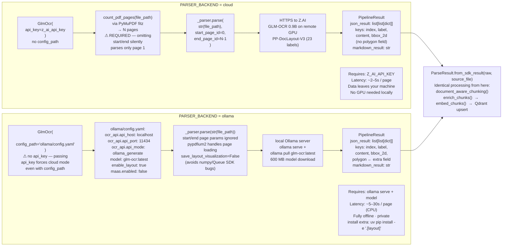

# Cloud vs Ollama Parsing Paths

`PARSER_BACKEND` selects between two execution paths for the same GLM-OCR + PP-DocLayout-V3 stack. The cloud path sends documents to Z.AI's MaaS GPU and requires an explicit page range (a critical SDK footgun: without `start_page_id`/`end_page_id` the SDK silently parses only page 1). The Ollama path pulls the `glm-ocr:latest` model (600 MB) locally; the page range parameters are silently ignored as pypdfium2 handles loading. Both paths produce structurally identical `PipelineResult` objects — downstream processing is shared.

